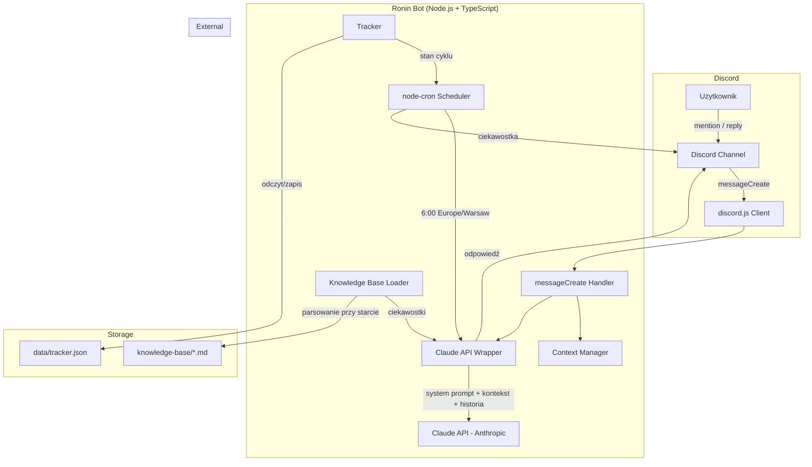

# PRD — Ronin: Bot Discordowy o Japonii

**Wersja:** 1.0
**Data:** 2026-03-15
**Status:** Draft

---

## Spis treści

1. [Opis projektu](#1-opis-projektu)
2. [Osobowość bota](#2-osobowość-bota)
3. [Funkcjonalności](#3-funkcjonalności)
4. [Architektura techniczna](#4-architektura-techniczna)
5. [Baza wiedzy](#5-baza-wiedzy)
6. [Kontekst konwersacji](#6-kontekst-konwersacji)
7. [Wymagania niefunkcjonalne](#7-wymagania-niefunkcjonalne)
8. [Poza zakresem](#8-poza-zakresem)
9. [Przykładowe interakcje](#9-przykładowe-interakcje)

---

## 1. Opis projektu

**Ronin** — bot Discordowy działający na jednym prywatnym serwerze, zbudowany w **TypeScript + discord.js**, z konwersacją napędzaną przez **Claude API (Anthropic)**.

Bot bazuje na przygotowanej bazie wiedzy o Japonii zapisanej w plikach Markdown — zawierającej ciekawostki z 8 kategorii. **Baza nie zawiera quizów — wyłącznie ciekawostki.**

Nazwa "Ronin" (samotny wojownik bez pana) odzwierciedla charakter bota — niezależny, sarkastyczny, dzielący się wiedzą na własnych warunkach.

---

## 2. Osobowość bota

**Priorytet: P0**

Bot ma osobowość **sarkastycznego samuraja**:

- Mówi **po polsku**
- Jest bezpośredni, lekko ironiczny, ale pod spodem kryje się pasja do dzielenia się wiedzą o Japonii
- Używa okazjonalnie japońskich wtrąceń (np. "Yare yare...", "Naruhodo...")
- Nie jest chamski — jest dowcipny i charyzmatyczny
- System prompt dla Claude API musi precyzyjnie definiować tę osobowość

### Acceptance criteria

- [ ] System prompt zdefiniowany w osobnym module (`src/ai/prompts.ts`)
- [ ] Bot odpowiada po polsku z okazjonalnymi japońskimi wtrąceniami
- [ ] Ton jest sarkastyczny, ale nie obraźliwy
- [ ] Osobowość jest spójna niezależnie od tematu rozmowy

---

## 3. Funkcjonalności

### 3.1. Codzienna ciekawostka (cron job)

**Priorytet: P0**

Codziennie o **6:00 rano (czas polski, `Europe/Warsaw`)** bot wysyła jedną ciekawostkę na dedykowany kanał.

| Parametr | Wartość |
|---|---|
| Godzina | 6:00 CET/CEST (`Europe/Warsaw`) |
| Kanał | Konfigurowalny w `.env` (`DAILY_CHANNEL_ID`) |
| Scheduler | `node-cron` |

#### Mechanizm bez powtórek

- Bot przechodzi przez całą pulę ciekawostek zanim zacznie cykl od nowa
- Kolejność: **losowa w ramach cyklu**, ale bez powtórek do wyczerpania puli
- Śledzenie wysłanych ciekawostek: **persystentne** (plik JSON — `data/tracker.json`)
- Wiadomość zawiera **kategorię** z emoji + nazwa kategorii

#### Acceptance criteria

- [ ] Cron job uruchamia się codziennie o 6:00 czasu polskiego
- [ ] Ciekawostka wysyłana na kanał z `DAILY_CHANNEL_ID`
- [ ] Wiadomość zawiera emoji + nazwę kategorii
- [ ] Brak powtórek do wyczerpania puli (237 ciekawostek w 8 kategoriach)
- [ ] Po wyczerpaniu puli cykl zaczyna się od nowa (reset trackera)
- [ ] Stan trackera przeżywa restart bota (plik JSON)
- [ ] Ciekawostka jest "opowiedziana" przez Claude API z osobowością bota, a nie wysyłana jako surowy tekst

### 3.2. Interakcja konwersacyjna

**Priorytet: P0**

Bot reaguje na wiadomości użytkowników i prowadzi rozmowę z kontekstem.

#### Wyzwalacze reakcji

| Wyzwalacz | Reakcja |
|---|---|
| Mention (`@Ronin`) | Tak |
| Reply na wiadomość bota | Tak |
| Zwykła wiadomość bez mentiona/reply | **NIE** |

#### Kontekst konwersacji

- Utrzymywany in-memory (Map per channel ID)
- Limit: konfigurowalne N ostatnich wiadomości (`CONVERSATION_CONTEXT_LIMIT`, domyślnie 8)
- Struktura: tablica par (user + assistant) z timestampami
- Kontekst **NIE jest persystentny** między restartami — to akceptowalne

#### Zapytanie do Claude API

Każde zapytanie zawiera:
1. System prompt z osobowością
2. Kontekst bazy wiedzy (jedna losowa ciekawostka z rozpoznanej kategorii)
3. Historia konwersacji (ostatnie N wiadomości)

#### Acceptance criteria

- [ ] Bot odpowiada na mention (`@Ronin`)
- [ ] Bot odpowiada na reply do swoich wiadomości
- [ ] Bot **ignoruje** zwykłe wiadomości
- [ ] Bot utrzymuje kontekst rozmowy per kanał
- [ ] Kontekst wygasa po skonfigurowanym czasie nieaktywności
- [ ] Bot nie reaguje na wiadomości innych botów
- [ ] Bot nie reaguje na własne wiadomości

### 3.3. Prośba o ciekawostkę z kategorii

**Priorytet: P0**

Użytkownik może poprosić bota o ciekawostkę z konkretnej kategorii (np. "@Ronin powiedz coś o kuchni japońskiej").

#### Mechanizm

1. Bot (kod, nie Claude) rozpoznaje kategorię z wiadomości — dopasowanie słów kluczowych do listy kategorii
2. Losuje jedną ciekawostkę z tej kategorii z bazy wczytanej przy starcie
3. Wstrzykuje ją do kontekstu promptu Claude API
4. Claude opowiada ją w stylu bota
5. Jeśli kategoria nie istnieje — bot informuje i podaje listę dostępnych kategorii

#### Acceptance criteria

- [ ] Bot rozpoznaje prośbę o ciekawostkę z konkretnej kategorii
- [ ] Bot losuje jedną ciekawostkę z dopasowanej kategorii i wstrzykuje do kontekstu
- [ ] Bot informuje o braku kategorii i podaje listę dostępnych, gdy kategoria nie istnieje
- [ ] Odpowiedź jest sformułowana w osobowości bota

### 3.4. Lista kategorii

**Priorytet: P1**

Użytkownik może zapytać o dostępne kategorie (np. "@Ronin jakie masz kategorie?").

Bot zwraca listę wszystkich kategorii z:
- Emoji przypisanym do kategorii
- Nazwą kategorii
- Liczbą ciekawostek

#### Acceptance criteria

- [ ] Bot rozpoznaje pytanie o kategorie
- [ ] Bot zwraca pełną listę z emoji, nazwami i liczbami ciekawostek
- [ ] Odpowiedź jest sformułowana w osobowości bota

---

## 4. Architektura techniczna

### 4.1. Stack technologiczny

| Komponent | Technologia |
|---|---|
| Runtime | Node.js + TypeScript |
| Discord | `discord.js` (najnowsza stabilna wersja) |
| AI | `@anthropic-ai/sdk` — model `claude-sonnet-4-5` (konfigurowalny w `.env`) |
| Scheduler | `node-cron` |
| Baza wiedzy | Pliki Markdown w `knowledge-base/` |
| Logowanie | `pino` |
| Tracking | Plik JSON (`data/tracker.json`) |

### 4.2. Struktura projektu

```
ronin/
├── package.json
├── tsconfig.json
├── .env
├── .env.example
├── knowledge-base/           # Baza wiedzy (pliki MD)
│   ├── historia.md
│   ├── kultura.md
│   ├── kuchnia.md
│   ├── jezyk.md
│   ├── technologia.md
│   ├── natura.md
│   ├── codzienne-zycie.md
│   └── mitologia.md
├── data/                     # Dane persystentne
│   └── tracker.json          # Śledzenie wysłanych ciekawostek
└── src/
    ├── index.ts              # Entry point, inicjalizacja bota
    ├── config.ts             # Konfiguracja z .env
    ├── bot/
    │   ├── client.ts         # Inicjalizacja discord.js client
    │   ├── events/
    │   │   ├── messageCreate.ts  # Handler mention/reply
    │   │   └── ready.ts          # On ready event
    │   └── scheduler.ts      # Cron job — codzienna ciekawostka
    ├── ai/
    │   ├── claude.ts         # Wrapper na Claude API
    │   ├── prompts.ts        # System prompts (osobowość, konteksty)
    │   └── context.ts        # Zarządzanie kontekstem konwersacji
    ├── knowledge/
    │   ├── loader.ts         # Parser plików MD
    │   ├── categories.ts     # Zarządzanie kategoriami
    │   └── tracker.ts        # Śledzenie wysłanych ciekawostek (cykl)
    └── utils/
        └── logger.ts         # Logowanie (pino)
```

### 4.3. Diagram architektury



### 4.4. Zmienne środowiskowe (.env)

```env
# Discord
DISCORD_TOKEN=
DISCORD_CLIENT_ID=
DAILY_CHANNEL_ID=

# Anthropic
ANTHROPIC_API_KEY=
CLAUDE_MODEL=claude-sonnet-4-5

# Konwersacja
CONVERSATION_CONTEXT_LIMIT=8
# Timezone
TZ=Europe/Warsaw
```

---

## 5. Baza wiedzy

### 5.1. Struktura plików

Każdy plik Markdown w `knowledge-base/` ma strukturę:

```markdown
# Kategoria: Nazwa

- Ciekawostka pierwsza...
- Ciekawostka druga...
```

Bot parsuje te pliki przy starcie i ładuje do pamięci.

### 5.2. Aktualne statystyki

| Kategoria | Plik | Liczba ciekawostek | Emoji |
|---|---|---|---|
| Historia | `historia.md` | 38 | 🏯 |
| Kultura | `kultura.md` | 32 | 🎭 |
| Kuchnia | `kuchnia.md` | 35 | 🍱 |
| Język | `jezyk.md` | 24 | 🗾 |
| Technologia | `technologia.md` | 27 | ⚙️ |
| Natura | `natura.md` | 27 | 🌸 |
| Codzienne życie | `codzienne-zycie.md` | 27 | 🏙️ |
| Mitologia | `mitologia.md` | 27 | ⛩️ |
| **Łącznie** | | **237** | |

### 5.3. Rozszerzalność

Dodanie nowej kategorii = dodanie nowego pliku `.md` w `knowledge-base/` z odpowiednią strukturą. Bot ładuje wszystkie pliki z katalogu przy starcie — nie wymaga zmian w kodzie.

---

## 6. Kontekst konwersacji

**Priorytet: P0**

### 6.1. Szczegóły implementacji

| Parametr | Wartość |
|---|---|
| Przechowywanie | In-memory (`Map<channelId, ConversationEntry[]>`) |
| Limit wiadomości | Konfigurowalny (`CONVERSATION_CONTEXT_LIMIT`, domyślnie 8) |
| Persystencja | NIE — resetuje się przy restarcie bota |
| Scope | Per kanał/wątek |

### 6.2. Struktura wpisu

```typescript
interface ConversationEntry {
  role: 'user' | 'assistant';
  content: string;
  timestamp: number;
}
```

### 6.3. Cykl życia

1. Użytkownik wysyła wiadomość (mention/reply)
2. System pobiera historię konwersacji dla danego kanału
3. Filtruje wpisy starsze niż timeout
4. Buduje zapytanie: system prompt + baza wiedzy + historia + nowa wiadomość
5. Wysyła do Claude API
6. Zapisuje odpowiedź w historii
7. Jeśli historia > limit — usuwa najstarsze wpisy

---

## 7. Wymagania niefunkcjonalne

### 7.1. Error handling (P0)

- Bot **nie crashuje** przy błędach API (Claude/Discord)
- Graceful error handling z logowaniem błędów
- Przy błędzie Claude API — bot informuje użytkownika w swoim stylu (np. "Yare yare... coś się zacięło")
- Przy błędzie Discord API — logowanie i retry z backoff

#### Acceptance criteria

- [ ] Błąd Claude API nie powoduje crasha
- [ ] Błąd Discord API nie powoduje crasha
- [ ] Błędy są logowane z pełnym kontekstem
- [ ] Użytkownik dostaje informację zwrotną przy błędzie

### 7.2. Rate limiting (P1)

- Cooldown per user: max 5 wiadomości na minutę
- Przy przekroczeniu limitu — bot informuje użytkownika w swoim stylu

#### Acceptance criteria

- [ ] Bot ogranicza odpowiedzi do 5/min per user
- [ ] Bot informuje użytkownika o przekroczeniu limitu
- [ ] Rate limit nie wpływa na cron job

### 7.3. Logowanie (P0)

- Biblioteka: `pino`
- Logi z timestampami
- Poziomy: info, warn, error
- Logowanie: zapytania do Claude API, błędy, starty/stopy

#### Acceptance criteria

- [ ] Logi mają czytelny format z timestampami
- [ ] Logowane są kluczowe zdarzenia (start, cron, zapytania, błędy)

### 7.4. Startup (P0)

Przy starcie bot loguje:
- Ile kategorii załadował
- Ile ciekawostek w puli
- Ile ciekawostek pozostało w cyklu (tracker)
- Status połączenia z Discord

#### Acceptance criteria

- [ ] Bot loguje statystyki bazy wiedzy przy starcie
- [ ] Bot loguje status połączenia z Discord
- [ ] Bot loguje stan trackera cyklu

### 7.5. Graceful shutdown (P1)

- Obsługa `SIGINT` i `SIGTERM`
- Zamknięcie połączenia z Discord
- Zapisanie stanu trackera

#### Acceptance criteria

- [ ] Bot reaguje na SIGINT/SIGTERM
- [ ] Połączenie z Discord jest zamykane gracefully
- [ ] Stan trackera jest zapisywany przy zamknięciu

### 7.6. Konfigurowalność (P0)

Wszystkie kluczowe wartości w `.env`, nie hardcoded.

---

## 8. Poza zakresem (out of scope)

- **Quizy i gry** — baza wiedzy zawiera wyłącznie ciekawostki
- **Slash commands** — interakcja tylko przez mention/reply
- **Multi-server support** — bot działa na jednym serwerze
- **Dashboard / panel admina**
- **Internacjonalizacja** — bot mówi tylko po polsku
- **Persystencja kontekstu** — kontekst rozmów ginie przy restarcie

---

## 9. Przykładowe interakcje

### 9.1. Poranna ciekawostka (automatyczna, cron job)

```
🏯 Kategoria: Historia

Yare yare... Czy wiesz, że w okresie Edo samurajowie stanowili zaledwie
5-7% populacji Japonii? A zachowywali się, jakby byli co najmniej połową.
Trochę jak ja na tym serwerze.
```

### 9.2. Użytkownik prosi o ciekawostkę

```
User: @Ronin opowiedz mi coś o kuchni
Bot: Naruhodo... Kuchnia, tak? Wasabi, które dostajesz w 99% restauracji
poza Japonią, to tak naprawdę barwiony chrzan. Prawdziwe wasabi kosztuje
około 250 zł za kilogram i traci smak po 15 minutach od starcia. Ale Ty
pewnie i tak zalewasz wszystko soją, więc jaka różnica. 🍣
```

### 9.3. Użytkownik pyta o kategorie

```
User: @Ronin jakie masz kategorie?
Bot: Oto moje domeny wiedzy, grasshopper:
🏯 Historia — 38 ciekawostek
🎭 Kultura — 32 ciekawostki
🍱 Kuchnia — 35 ciekawostek
🗾 Język — 24 ciekawostki
⚙️ Technologia — 27 ciekawostek
🌸 Natura — 27 ciekawostek
🏙️ Codzienne życie — 27 ciekawostek
⛩️ Mitologia — 27 ciekawostek

Wybieraj mądrze. Albo nie wybieraj — i tak Ci coś powiem.
```

### 9.4. Kontynuacja rozmowy (kontekst)

```
User: @Ronin powiedz coś o samurajach
Bot: [ciekawostka o samurajach]

User: A co z ich kodeksem?
Bot: [odpowiada z kontekstem — wie, że rozmowa dotyczy samurajów,
odpowiada o bushido]
```

### 9.5. Nieistniejąca kategoria

```
User: @Ronin powiedz coś o sporcie
Bot: Sport? Hmm... tego nie mam w swoim arsenale wiedzy. Ale mam za to:
🏯 Historia, 🎭 Kultura, 🍱 Kuchnia, 🗾 Język, ⚙️ Technologia,
🌸 Natura, 🏙️ Codzienne życie, ⛩️ Mitologia.
Wybierz coś z listy, a nie wymyślaj. Naruhodo?
```
